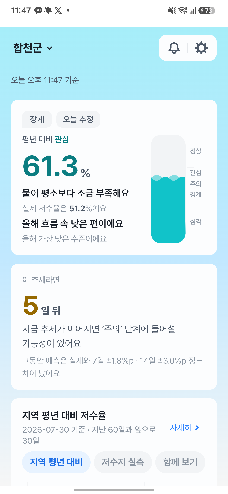
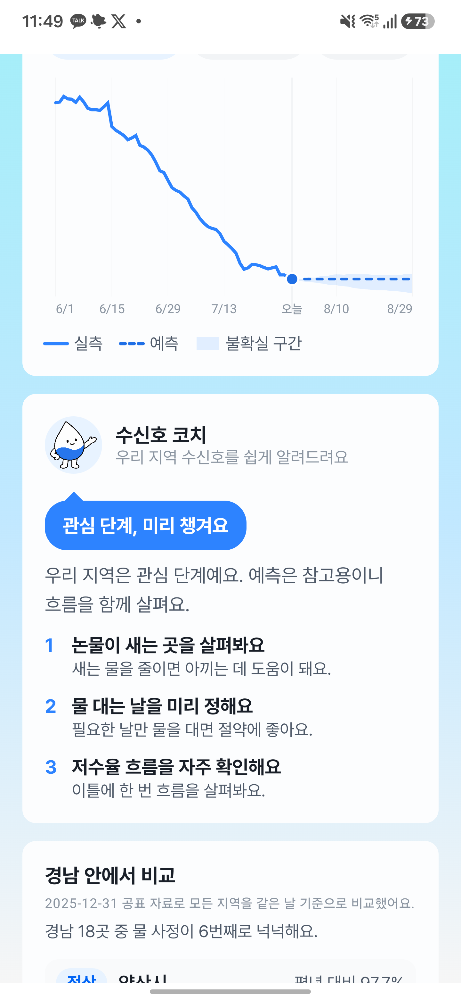
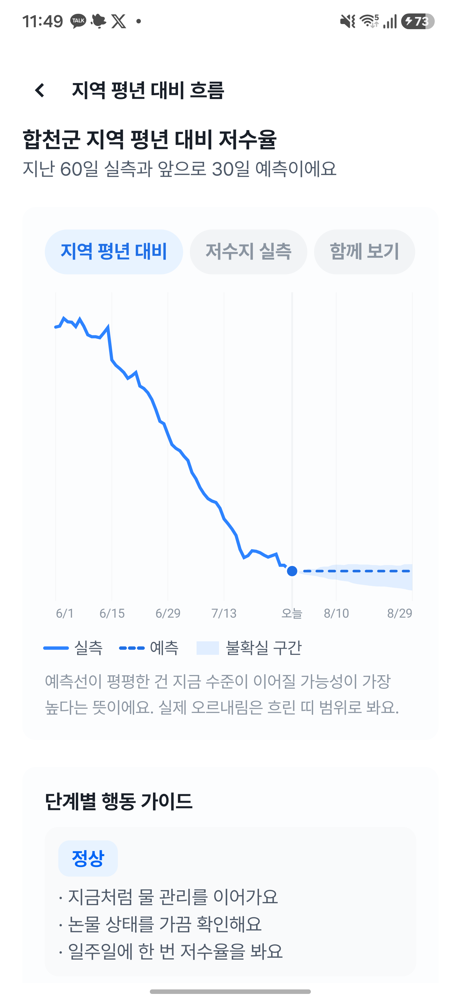
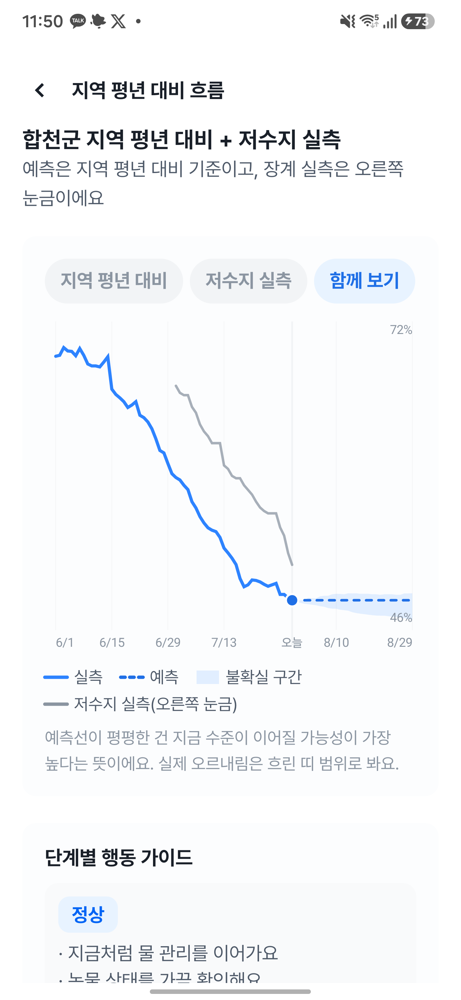
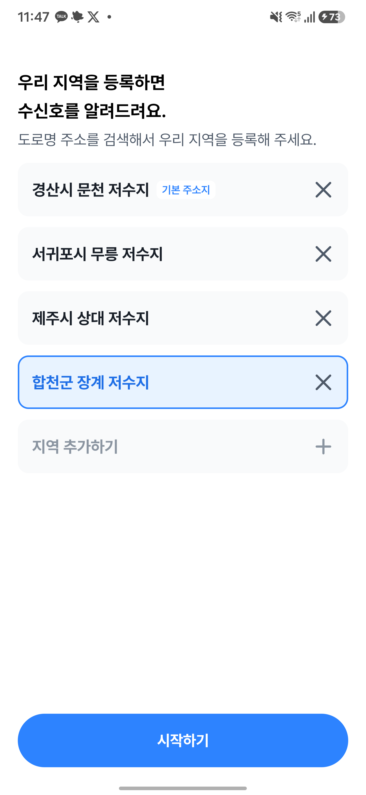
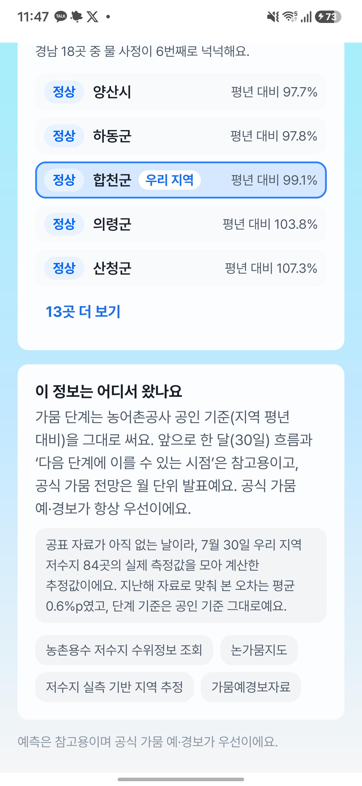

> 작품명: 수신호
>
> 비워 둔 칸은 `(     )` 로 표시했다. 이름, 소속, 연락처, 생년월일, 서명, 날짜를 채운다.

# 제3회 KRC AI 디지털 혁신 공모전 기획서

| 항목 | 내용 |
|---|---|
| 접수번호 | (접수처 기재) |
| 분 야 | 서비스개발 |
| 주 제 | ■ 안전강화 &nbsp;&nbsp; □ 대민서비스 |
| 작 품 명 | 수신호: 저수지 데이터로 다음 가뭄 단계를 미리 알리는 농업용수 관리 코치 |

## □ 활용데이터

**한국농어촌공사 공공데이터 5종**

| 데이터명 | 형태 | 실제 사용한 원천 파일 |
|---|---|---|
| 한국농어촌공사_농촌용수 저수지 수위정보 조회 | OpenAPI (XML) | 실시간 조회 |
| 한국농어촌공사_논가뭄지도 | 파일데이터 | `한국농어촌공사_논가뭄지도_20251231.csv` |
| 한국농어촌공사_전국 저수지 일별 저수율 | 파일데이터 | `한국농어촌공사_전국 저수지 일별 저수율_20251231.csv` |
| 한국농어촌공사_가뭄예경보자료 | 파일데이터 | `한국농어촌공사_가뭄예경보자료_20251201.csv` |
| 한국농어촌공사_농업기반시설 시설제원_저수지 | 파일데이터 | `한국농어촌공사_농업기반시설 시설제원_저수지_20250925.csv` |

**(타기관) 행정안전부_도로명주소 조회 서비스**

사용자가 입력한 주소를 시군 코드로 바꾸는 데에만 쓴다. 주소 원문은 대표 저수지를 정한 뒤
바로 버리며 데이터베이스에 담지 않는다.

## □ 서비스개요

| 항목 | 내용 |
|---|---|
| 형태 | ■ 모바일 앱(APP) &nbsp;&nbsp; ■ 웹(Web) &nbsp;&nbsp; □ 지식재산(특허) &nbsp;&nbsp; □ 기타 |
| 서비스명 | 수신호 |
| 개발일자 | 2026.07.19. ~ 2026.07.31. |
| 설명 | 한국농어촌공사 공공데이터로 우리 지역 저수지 물 사정을 보여주고, 이 추세가 이어지면 다음 가뭄 단계가 언제인지와 오늘 해야 할 일 3가지를 알려주는 서비스입니다. |
| URL | 웹 `https://3rd-krc-ai-digital-web.vercel.app/` (QR 삽입)<br>Android 설치 `https://github.com/indaegu/3rd-krc-ai-digital/releases/latest` (QR 삽입, Android 8.0 이상) |

## □ 추진배경

### 서비스 구현의 목적과 배경

농업용수는 부족을 알고 나서는 늦습니다. 관개 순번 조정, 논물 걸러대기, 용수 절감은 가뭄
단계가 나빠진 뒤가 아니라 나빠지기 전에 시작해야 효과가 있습니다. 그런데 지금 공개된 정보는
세 가지 이유로 그 판단을 돕지 못합니다.

첫째, **오늘 값이 없습니다.** 공식 가뭄 단계의 주계열인 논가뭄지도는 연 1회 공표됩니다.
최신 공표가 2025년 12월 31일 기준이므로, 오늘 화면을 열면 반년 전 값을 보게 됩니다.

둘째, **숫자만 있습니다.** 저수율과 그래프는 공개돼 있지만, 정작 물을 대는 농업인이
"지금 물을 대도 되는지"를 판단하려면 평년 대비 저수율과 가뭄 단계 기준을 스스로 이어
붙여야 합니다.

셋째, **읽기 어렵습니다.** 주 사용자는 고령 농업인입니다. 작은 글씨, 전문 용어, 회원가입
절차가 그대로 진입 장벽이 됩니다.

### 국내외 시장 및 경쟁 현황

국내 공공 서비스는 저수율과 가뭄 단계를 **조회**하는 데까지 제공합니다. 농업용수 관련
민간 서비스는 대체로 특정 작물이나 스마트팜 설비와 묶여 있어, 설비 없이 논농사를 짓는
사용자가 쓸 수 있는 무료 서비스는 드뭅니다.

수신호는 같은 공개 데이터를 쓰되 **조회에서 멈추지 않고 시점과 행동까지** 갑니다. 새로운
데이터를 요구하지 않으므로 기존 공공데이터만으로 곧바로 확장할 수 있습니다.

## □ 주요내용

### 사용 흐름 (회원가입 없음)

```
스플래시 → 온보딩 3장 → 약관 동의 → 주소 검색 또는 저수지 이름 검색
        → 우리 지역 대표 저수지 등록 → 메인 → 흐름 상세
```

### 구현 화면

아래 화면은 2026년 7월 30일 실기기(Android 16, Galaxy S25)에서 최신 빌드(0.2.3)로 직접
캡처한 것이다. 합천군 장계 저수지를 등록한 상태이며 모든 수치는 실제 응답이다.

| | |
|---|---|
|  |  |
| **① 메인 상단.** "오늘 추정" 배지로 공표가 없는 날임을 밝힌다. 평년 대비 61.3%(관심), 실제 저수율 51.2%를 함께 보여주고, 게이지 눈금에 5단계 위치를 표시한다. "이 추세라면 5일 뒤 주의 단계"와 예측 오차(7일 ±1.8%p, 14일 ±3.0%p)를 같은 카드에 적는다. | **② 수신호 코치.** 단계에 맞는 행동 3가지를 쉬운 문장으로 제시한다. 행동은 검증된 카탈로그에서 서버가 고르고 LLM은 표현만 맡는다. |
|  |  |
| **③ 흐름 상세.** 지난 60일 실측과 앞으로 30일 예측, 불확실 구간을 함께 그린다. 예측선이 평평한 이유를 문장으로 설명한다. | **④ 함께 보기.** 지역 평년 대비(왼쪽 눈금)와 대표 저수지 실측(오른쪽 눈금)을 겹쳐 본다. 단위가 다른 두 값을 축을 나눠 표시한다. |
|  |  |
| **⑤ 지역 설정.** 여러 지역을 등록하고 대표 지역을 정한다. 지금 보고 있는 지역은 테두리로, 기본 주소지는 배지로 구분한다. | **⑥ 주변 비교와 근거.** 같은 도 안에서 우리 지역 위치를 보여주고, 사용한 데이터 원천과 추정 근거(저수지 84곳, 오차 0.6%p)를 밝힌다. |

| 순서 | 카드 | 보여주는 것 |
|---|---|---|
| 1 | 오늘 우리 저수지 | 대표 저수지 실측 저수율과 지역 평년 대비 값, 공식 가뭄 단계 게이지 |
| 2 | 이 추세라면 | 다음 단계 도달 예상 시점과 추세 방향 |
| 3 | 저수율 흐름 | 실측 30일과 예측 30일 그래프. 지역 평년 대비, 저수지 실측, 함께 보기 3가지 지표 전환 |
| 4 | 수신호 코치 | 오늘 할 일 3가지 |
| 5 | 주변 지역 비교 | 같은 시도 안에서 우리 지역 위치 |
| 6 | 근거와 한계 | 사용한 데이터 원천, 기준 시각, 추정 여부와 검증 오차 |

### 주요 기술과 기능

**하나의 계약을 웹과 안드로이드가 공유합니다.** OpenAPI 문서 하나를 단일 출처로 두고
공개 API 8개를 정의했습니다. 웹(Next.js)과 안드로이드(Kotlin, Jetpack Compose)가 이 계약에서
생성한 같은 타입을 씁니다. 가뭄 단계 임계값(70, 60, 50, 40)은 서버 한 곳에만 두고 두
클라이언트는 서버가 확정한 값을 표시만 합니다. 두 화면이 서로 다른 숫자를 말할 수 없습니다.

**주소를 몰라도 등록할 수 있습니다.** 도로명주소로 시군을 찾은 뒤 읍면동과 리 단위까지
좁혀 대표 저수지를 정합니다. 넓은 시군에서는 주소만으로 원하는 저수지가 잡히지 않아
(실측: 제주시 5곳), 저수지 이름으로 직접 찾아 등록하는 길도 함께 제공합니다.

**통신이 끊겨도 화면이 유지됩니다.** 저수지 주변은 음영지역이 많습니다. 마지막으로 받은
화면을 기기에 남겨 두었다가 통신이 끊기면 그대로 보여주고, "언제 받은 정보인지"를 함께
적습니다. 다만 백그라운드 알림은 저장본으로 판단하지 않습니다. 며칠 전 물 사정을 오늘
일처럼 알리면 안 되기 때문입니다.

**고령 사용자를 기준으로 만들었습니다.** 회원가입, 로그인, 알림 권한 요청이 없습니다.
모든 문구는 짧은 해요체이며 "예측", "확률" 같은 단정 표현 대신 "보여요"를 씁니다. 가뭄
단계 색은 그래픽용과 글자용을 분리해 명도 대비 기준(WCAG AA)을 맞췄고, 큰 글꼴 1.3배,
스크린리더, 화면 애니메이션 끄기 설정을 지원합니다.

### 기존 유사 서비스와의 차별성 및 독창성

| 단계 | 기존 공개 서비스 | 수신호 |
|---|---|---|
| 현재 | 저수율 숫자와 그래프 | 같음. 다만 공표가 없는 날은 실측으로 오늘 값을 추정 |
| 흐름 | 없음 | 30일 예측과 불확실 구간 |
| **시점** | 없음 | **다음 단계 도달 예상 날짜** |
| **행동** | 없음 | **오늘 할 일 3가지** |
| 근거 | 없음 | 사용 데이터, 기준일, 검증 오차, 한계를 항상 같은 자리에 표기 |

**시점을 알려주는 것이 핵심입니다.** "지금 관심 단계"는 행동을 바꾸지 않지만, "이 추세가
이어지면 18일 뒤 주의 단계"는 관개 순번 조정을 지금 시작할 이유가 됩니다.

**정직함을 기능으로 넣었습니다.** 예측이 틀릴 수 있다는 사실을 감추면 한 번 틀렸을 때
서비스 전체를 신뢰하지 않게 됩니다. 그래서 오차, 기준일, 추정 여부, 공식 전망과의 차이를
화면에 항상 함께 적습니다.

## □ AI 및 데이터 활용성

### 한국농어촌공사 공공데이터를 어떻게 활용했는가

| 데이터 | 활용 범위와 가공 |
|---|---|
| 농촌용수 저수지 수위정보 조회 | 대표 저수지의 오늘 저수율과 수위를 실시간 조회. 시군 단위 조회는 한 번에 31일까지만 응답하므로 창을 나눠 부르고 60분 캐시로 재사용 |
| 논가뭄지도 | 시군별 평년 대비 저수율과 공식 가뭄 단계의 주계열. 예측 모델의 학습과 백테스트 대상 |
| 전국 저수지 일별 저수율 | 저수지별 과거 흐름 참고와 지역 추정 모델의 검증 자료 |
| 가뭄예경보자료 | 공식 1, 2, 3개월 전망. 우리 예측을 대체하지 않고 나란히 표시 |
| 농업기반시설 시설제원_저수지 | 유효저수량, 수혜면적, 소재지를 정규화해 대표 저수지 결정과 지역 추정의 가중치로 사용 |

원천 CSV는 결측, 이상치, 단위를 정규화해 스냅샷으로 저장하고, 원천 파일명과 체크섬,
행 수, 격리한 행 수를 담은 적재 리포트를 함께 커밋합니다. 같은 입력에서 같은 결과가
재현되도록 하기 위해서입니다.

### AI 활용 기술 1. 저수율 예측 모델

모델을 고르지 않고 **후보 5종을 같은 조건으로 비교**했습니다.

| 모델 | 7일 MAE | 14일 MAE | 30일 MAE |
|---|---:|---:|---:|
| **naive (채택)** | **1.8493** | **3.0463** | **4.3201** |
| 감쇠추세(damped) | 2.2156 | 3.4536 | 4.7857 |
| 지수평활(ses) | 2.3209 | 3.4152 | 4.5889 |
| 이동평균 7일(ma7) | 2.4938 | 3.5603 | 4.7056 |
| 선형회귀(linear) | 3.3464 | 5.2300 | 8.7553 |

단위는 %p(평년 대비 저수율의 절대오차)입니다. 채택 규칙은 14일 MAE 최저이며, 2위와의
차이가 0.3689%p로 동률 규칙(0.05%p) 적용 대상이 아닙니다.

**평가 방법 (rolling origin backtest)**

| 항목 | 값 |
|---|---|
| 대상 | 154개 시군 |
| 기준 시점 | 770개 (시군당 5개, 14일 간격) |
| 표본 | 23,100개 |
| 예측 지평 | 30일 |

리포트에 원천 파일명과 체크섬, 실행 시각, 커밋 해시, 모델 상수를 함께 커밋했습니다.
다시 실행하면 같은 수치가 나오며, 문서와 계약, 화면 예시의 수치가 리포트와 어긋나면
자동 검사가 실패합니다.

**오차를 숨기지 않습니다.** 화면에 "7일 ±1.8%p, 14일 ±3.0%p"를 그대로 적고, 예측 구간은
잔차 분위수(25~75%)로 띠를 그려 불확실성을 함께 보여줍니다.

**다음 단계 도달 시점 산식** (선형 외삽, 참고 표현 전용)

```
남은 일수 = 올림( (현재 평년대비 - 목표 단계 임계) / 일일 변화량 )
예) 68%, 하루 0.45%p 하락, 목표 60% → 18일
예) 46%, 하루 0.67%p 하락, 목표 40% → 9일
```

### AI 활용 기술 2. 오늘의 지역 값 추정

논가뭄지도가 연 1회 공표라 오늘 값이 비어 있습니다. 저수지 실측 수위로 같은 값을 다시
만들되, **정확도를 검증한 지역에만** 적용합니다.

```
통합저수율(시군, 날짜) = Σ(저수율 × 유효저수량) / Σ(유효저수량) × 보정계수
평년 대비(시군, 날짜)  = 통합저수율 ÷ 평년(같은 월일) × 100
```

과신을 막기 위해 구간을 **시간순으로 3분할**했습니다.

| 구간 | 기간 | 쓰임 |
|---|---|---|
| 학습 | 2025.01.01 ~ 08.31 | 보정계수 적합. 여기까지만 |
| 검증 | 2025.09.01 ~ 10.31 | 게이트 판정 전용 |
| 시험 | 2025.11.01 ~ 12.31 | 성능 보고 전용 |

같은 구간에서 계수를 맞추고 성능까지 보고하면 좋아 보일 수밖에 없습니다. 실제로 구간을
나눠 보니 **학습 구간만으로는 통과했던 13개 지역이 홀드아웃에서 탈락**했습니다.

| 항목 | 값 |
|---|---|
| 후보 시군 | 114곳 |
| 게이트 통과 | **70곳** |
| 홀드아웃 표본 | 4,270개 |
| 홀드아웃 MAE | **0.7394 %p** |
| 중위 오차 | 0.3543 %p |
| 90분위 오차 | 1.875 %p |
| **가뭄 단계 일치율** | **100%** |

추정으로 채운 날은 화면에 그 사실과 검증 오차, 사용한 저수지 수와 용량 비중을 함께
적습니다. 게이트를 통과하지 못한 44개 시군에는 추정을 적용하지 않고 공표값 기준일을
그대로 보여줍니다.

### AI 활용 기술 3. 제한형 LLM 코치와 정적 폴백

**LLM에게 판단을 맡기지 않습니다.**

| 구분 | 담당 |
|---|---|
| 가뭄 단계, 저수율, 도달 시점, 행동 3가지의 선택과 순서 | **서버가 확정** |
| 그 사실을 고령 사용자가 읽기 쉬운 문장으로 바꾸는 일 | LLM |

행동은 미리 검증된 카탈로그(공인 단계 5종 곱하기 3개)에서만 고릅니다. LLM이 카탈로그에
없는 행동을 만들거나 숫자를 바꾸면 의미 검증에서 걸러 폐기합니다.

**어떤 실패에서도 화면이 깨지지 않습니다.** 기능 꺼짐, 캐시 장애, 예산 초과, 일일 한도,
동시 생성, 시간 초과, 호출량 초과, 제공자 오류, 응답 거부, 길이 초과, 검증 실패 가운데
어느 경우에도 정상 응답(HTTP 200)과 행동 3가지를 유지합니다. 응답에 생성 경로와 폴백
사유를 실어 사용자와 운영자가 함께 확인할 수 있습니다.

**비용과 남용을 통제합니다.**

| 가드 | 값 |
|---|---|
| 공모전 종료까지 누적 API 상한 | 미화 5달러 |
| 일일 신규 생성 상한 | 20회 |
| 검증 통과 응답 캐시 | 30일 |
| 동시 생성 방지 | 생성 잠금 15초 |
| 공개 API 속도 제한 | 코치 20회/분, 주소 검색 30회/분 |

**개인정보를 LLM에 보내지 않습니다.** 전달하는 것은 단계와 계절, 구간 같은 비식별 값뿐
입니다. 주소 원문, 지역 이름, 등록 지역 목록, IP, 기기 식별자는 프롬프트와 로그 어디에도
넣지 않습니다. 캐시 키 자체를 비식별로 설계해 지역을 역추적할 수 없습니다.

## □ 추진성과

### 정량 성과

| 항목 | 값 |
|---|---|
| 예측 오차 | 7일 1.85%p, 14일 3.05%p, 30일 4.32%p |
| 백테스트 규모 | 154개 시군, 770개 기준 시점, 23,100 표본 |
| 지역 추정 정확도 | 홀드아웃 MAE 0.74%p, 가뭄 단계 일치율 100% |
| 추정 적용 지역 | 검증 통과 70개 시군 |
| 배포 결과물 | 웹 서비스, 서명된 Android 설치 파일(Android 8.0 이상) |
| 공개 API | 버전 고정 8개 |
| 자동 테스트 | 855개 통과(웹 745, 계약 51, LLM 59) |
| LLM 운영 비용 상한 | 미화 5달러 (설계상 고정) |

### 정성 성과

**공개 데이터를 그대로 쓰면서 판단 가능한 정보로 바꿨습니다.** 새 관측 설비나 추가
데이터 없이, 이미 개방된 5종만으로 오늘 값과 다음 단계 시점, 행동을 만들어 냅니다.

**공표 공백을 정직하게 메우는 방법을 만들었습니다.** 연 1회 공표라는 제약을 실측 기반
추정으로 보완하되, 검증을 통과한 지역에만 적용하고 오차를 함께 표기합니다. 같은 방법을
다른 지역이나 다른 지표로 넓힐 수 있습니다.

**AI를 쓰되 책임 경계를 분명히 했습니다.** 판정은 서버가, 표현은 LLM이 맡고, LLM이 없어도
서비스가 완전히 동작합니다. 공공 서비스에 생성형 AI를 넣을 때 참고할 수 있는 구조입니다.

### 향후 기대 효과

**1단계, 농업인.** 회원가입 없이 우리 지역 물 사정과 오늘 할 일을 확인합니다. 기기에
저장하는 것이 코드 2개뿐이라 개인정보 부담이 없고, 웹은 링크 하나로 바로 씁니다.

**2단계, 수리계와 마을.** 같은 대표 저수지를 공유하는 이용자들이 같은 화면을 근거로 관개
순번을 논의합니다. 지역을 여러 개 등록하고 순서를 바꿀 수 있어 수리계장이 담당 저수지를
함께 관리할 수 있습니다.

**3단계, 지사와 지자체.** 시군 단위 비교 기능이 이미 들어 있습니다. 관할 저수지 일괄 조회,
단계 악화 지역 자동 보고, 기존 물관리 시스템과의 연계로 넓힐 수 있습니다.

**운영 비용이 낮습니다.** 공공데이터는 무료이고, 예측은 서버에서 계산하며, LLM은 캐시와
예산 가드로 상한이 고정돼 있습니다. 사용자가 늘어도 비용이 선형으로 늘지 않습니다.

### 한계를 함께 밝힙니다

1. 예측은 참고용입니다. 공식 가뭄 예경보가 우선이며 화면과 약관에 함께 적었습니다.
2. 지역 값 추정은 게이트를 통과한 70개 시군에만 적용합니다. 나머지는 공표값 기준일을
   그대로 보여줍니다.
3. 저수지 방류와 하류 안전 안내는 하지 않습니다. 만수위에 가까우면 공식 재난 문자를
   확인하도록 안내합니다.
4. 도달 시점은 선형 외삽이며 강우 예보를 넣지 않았습니다. 추세가 바뀌면 값도 바뀝니다.

## □ 추가로 개방이 필요한 데이터 (선택항목)

개발하면서 실제로 막혔던 지점을 순서대로 적습니다.

**1. 논가뭄지도의 갱신 주기 단축 또는 API 제공**

가장 큰 제약이었습니다. 연 1회 공표라 오늘 값이 없어, 저수지 실측으로 지역 값을 다시
계산하는 모델을 따로 만들어야 했습니다. 이 때문에 114개 시군 중 검증을 통과한 70곳에만
오늘 값을 보여줄 수 있습니다. 일 단위 또는 주 단위 갱신이나 조회 API가 열리면 추정 없이
전국에 정확한 값을 제공할 수 있습니다.

**2. 농업기반시설 시설제원에 위경도 좌표 추가**

시설제원에는 소재지 주소만 있고 좌표가 없습니다. 그래서 "가장 가까운 저수지"를 거리로
고르지 못하고 읍면동과 리 이름이 일치하는지로 좁히는 방식을 썼습니다. 좌표가 열리면
사용자 위치에서 실제로 가장 가까운 저수지를 정확히 고를 수 있습니다.

**3. 저수지와 수혜 구역(수리계, 관개 블록) 매핑**

현재는 시군 단위로만 사용자를 저수지에 잇습니다. 저수지별 수혜 구역 경계나 수리계 매핑이
열리면 "내 논에 물을 대는 저수지"를 정확히 연결할 수 있어, 수리계 단위 확장이 가능해집니다.

**4. 저수지 방류 및 용수 공급 계획**

지금은 만수위에 가까울 때 공식 재난 문자를 확인하도록 안내만 합니다. 계획 정보가 열리면
"언제 물을 받을 수 있는지"까지 안내할 수 있습니다.

---
